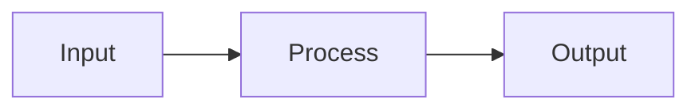

# Slidev Markdown Generation Rules

Rules for generating a valid `slides.md` from an outline.

## File Structure

```markdown
---
theme: <theme>
title: <deck title>
info: |
  <one-paragraph description of the deck>
lang: <BCP 47 language tag, e.g. en, zh-CN>
---

<!-- Cover slide content -->

---
layout: <layout>
---

<!-- Slide 2 content -->

---
...
```

## Headmatter (First Frontmatter Block)

The very first `---` block is the headmatter — it configures the entire deck.

| Field | Example | Notes |
|-------|---------|-------|
| `theme` | `seriph` | Slidev theme name |
| `title` | `Introduction to ML` | Shown in browser tab |
| `info` | multiline string | Shown in presenter mode |
| `lang` | `en`, `zh-CN` | BCP 47 tag matching the output language |
| `highlighter` | `shiki` | Code highlighter (default: shiki) |
| `lineNumbers` | `false` | Show line numbers in code blocks |
| `drawings` | `{persist: false}` | Drawing mode settings |
| `transition` | `slide-left` | Default slide transition |
| `mdc` | `true` | Enable Markdown Components (MDC) syntax |

Minimal example:

```yaml
---
theme: default
title: My Presentation
lang: en
---
```

## Slide Separators

- `---` alone on a line separates slides
- A YAML frontmatter block immediately after `---` configures that slide:

```markdown
---
layout: two-cols
---
```

- An empty separator means "use the default layout":

```markdown
---

# Next Slide
```

## Per-Slide Frontmatter Fields

| Field | Values | Purpose |
|-------|--------|---------|
| `layout` | cover, default, center, two-cols, two-cols-header, image-right, image-left, section, quote, fact, statement, end | Slide layout |
| `class` | Tailwind/UnoCSS utility classes | Extra CSS classes on the slide wrapper |
| `background` | URL or CSS color | Slide background image/color |
| `transition` | slide-left, slide-right, fade, none | Slide enter transition |
| `zoom` | `0.8` | Scale the slide content |

## Layout Usage Patterns

### cover

```markdown
---
layout: cover
background: '#1a1a2e'
---

# Presentation Title

A concise subtitle line

<div class="pt-12">
  <span class="px-2 py-1 rounded cursor-pointer" hover="bg-white bg-opacity-10">
    Press Space to start →
  </span>
</div>
```

### default

```markdown
---
layout: default
---

# Slide Heading

- Bullet point one
- Bullet point two
- Bullet point three
```

### two-cols

```markdown
---
layout: two-cols
---

# Left Column Heading

Left side content here.

::right::

Right side content here.
```

### image-right

```markdown
---
layout: image-right
image: https://example.com/image.jpg
---

# Content With Image

Text content on the left side.
```

### section

```markdown
---
layout: section
---

# Section Title

Brief description of what follows.
```

### center

```markdown
---
layout: center
---

# Centered Message

One powerful statement.
```

### quote

```markdown
---
layout: quote
---

"The quote text goes here."

— Attribution
```

### fact

```markdown
---
layout: fact
---

# 42%

Increase in efficiency after adoption.
```

### end

```markdown
---
layout: end
---

# Thank You

Questions? Reach me at hello@example.com
```

## Presenter Notes

Add notes as HTML comments immediately before the next `---`:

```markdown
# Slide Content

- Point one
- Point two

<!--
These notes are only visible in presenter mode.
Explain the key insight of this slide here.
-->
```

## Click Animations

Use `v-click` to reveal content step by step:

```markdown
# Animated Reveal

<v-click>

First item appears on first click.

</v-click>

<v-click>

Second item appears on second click.

</v-click>
```

Or use `v-clicks` for a list:

```markdown
<v-clicks>

- Item revealed on click 1
- Item revealed on click 2
- Item revealed on click 3

</v-clicks>
```

## Code Blocks

Use fenced code blocks with language identifiers:

````markdown
```python
def hello(name: str) -> str:
    return f"Hello, {name}!"
```
````

Line highlighting:

````markdown
```python {2}
def hello(name: str) -> str:
    return f"Hello, {name}!"  # highlighted
```
````

Step-by-step highlight:

````markdown
```python {1|2|all}
def hello(name: str) -> str:
    return f"Hello, {name}!"
```
````

## Mermaid Diagrams

Use Mermaid for flows, sequences, and diagrams:

````markdown

````

## LaTeX Math

Inline math: `$E = mc^2$`

Block math:

```markdown
$$
\frac{d}{dx} e^x = e^x
$$
```

## Mapping Outline Slide Types to Slidev

| Outline type | Slidev layout | Notes |
|--------------|--------------|-------|
| Cover | `cover` | Title + subtitle |
| Content (bullets) | `default` | Standard layout |
| Content (two-column) | `two-cols` | Use `::right::` divider |
| Section divider | `section` | Major topic break |
| Diagram / flow | `default` | Embed Mermaid fence |
| Code walkthrough | `default` | Use code fence with highlighting |
| Quote | `quote` | Attribution on second line |
| Key statistic | `fact` | Number + label |
| Closing | `end` | Call-to-action or contact |

## Generation Rules

1. Always start with a headmatter block (theme, title, lang at minimum).
2. First slide uses `layout: cover`.
3. Every content slide should have a heading (`#`). Exceptions: `quote`, `fact`, `statement`, and `end` layouts where the content itself serves as the focal element.
4. Keep bullet lists to 3-5 items per slide; split longer lists across slides.
5. Add a Mermaid diagram for any slide whose outline entry describes a flow, sequence, or relationship.
6. Use `v-clicks` for lists on teaching/tutorial slides to allow step-by-step reveals.
7. Every slide must have presenter notes (`<!-- ... -->`), even if brief.
8. Close with a `layout: end` slide.
